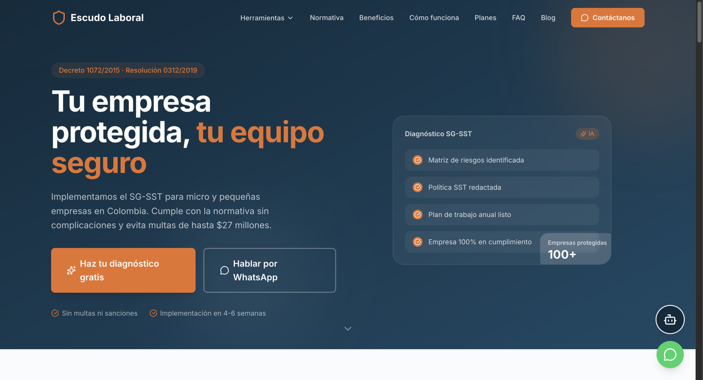
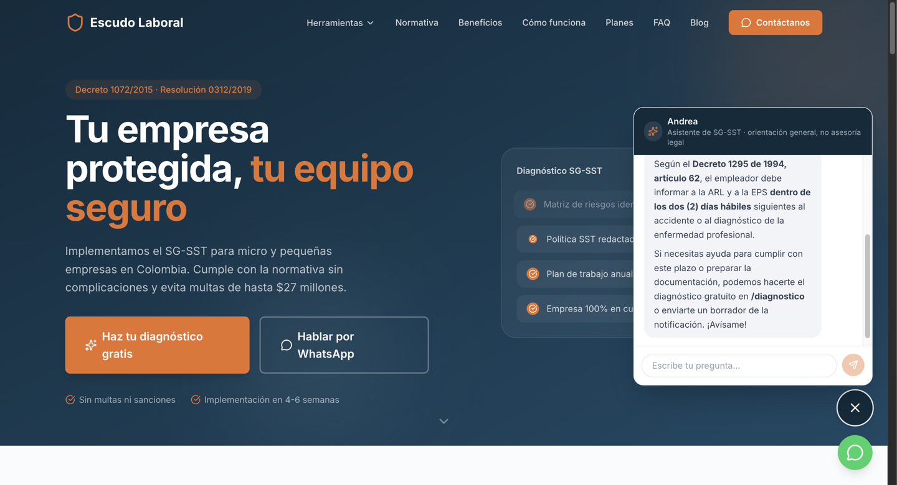
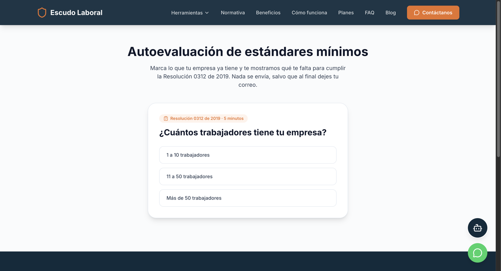

# Escudo Laboral

Plataforma web para que micro y pequeñas empresas de Colombia implementen el **Sistema de Gestión de Seguridad y Salud en el Trabajo (SG-SST)** exigido por el Decreto 1072 de 2015 y la Resolución 0312 de 2019. Atrae clientes con herramientas gratuitas y una asistente con IA, y los convierte en contactos por correo o WhatsApp.

**Sitio:** [escudo-laboral.vercel.app](https://escudo-laboral.vercel.app/)



## Andrea, la asistente con IA

Responde citando la norma que consultó. Ejemplo real: plazo para reportar un accidente de trabajo.



<p align="center">
  
  
</p>

## Qué hace

- **Andrea, asistente con IA:** responde dudas de SG-SST citando la norma real. Busca en un corpus propio de 12 normas (246 artículos) incluido en el código y no puede citar nada que no haya consultado.
- **Cinco herramientas gratis:** autoevaluación de estándares mínimos, diagnóstico con IA, generador de la política de SST en Word, plantillas en Word y calendario de obligaciones.
- **Contenido:** buscador de normas y 6 guías paso a paso.
- **Captura de contactos** por correo y WhatsApp, con límite de uso para evitar abuso.

## Stack

| Pieza | Tecnología |
|---|---|
| Aplicación | Next.js 16, React 19, Tailwind CSS 4, TypeScript |
| IA | Groq (`openai/gpt-oss-120b`) con herramientas de búsqueda sobre el corpus normativo |
| Límite de uso y métricas | Upstash Redis |
| Correos | Resend |
| Documentos Word | Librería `docx` |
| Publicación y analítica | Vercel, Vercel Web Analytics |

## Correr en local

```bash
npm install
npm run dev
```

Variables de entorno en `.env.local` (no se versiona):

```
GROQ_API_KEY=
RESEND_API_KEY=
KV_REST_API_URL=
KV_REST_API_TOKEN=
```

Sin claves, el sitio carga pero el chat, el diagnóstico y el envío de correos no funcionan.

## Evaluaciones

El comportamiento de la IA y de las herramientas se verifica con 10 grupos de evaluaciones automáticas:

```bash
npm run evals            # suite principal de la asistente
npm run evals:rapido     # versión corta
npm run evals:citas      # que solo cite normas consultadas
npm run evals:seguridad  # intentos de sacarla de su rol
npm run evals:limite     # límite de uso
```

Más en `package.json`: `evals:control`, `evals:ranking`, `evals:autoevaluacion`, `evals:calendario`, `evals:plantillas`, `evals:formato`, `evals:blog`.

## Estructura

- `src/lib/normativa/`: corpus de normas que consulta la asistente.
- `src/lib/documentos/`: generación de documentos Word.
- `evals/`: evaluaciones automáticas.

## Autor

Diseñado y desarrollado por [Alvaro Rojas](https://github.com/alvarorojasdev).
